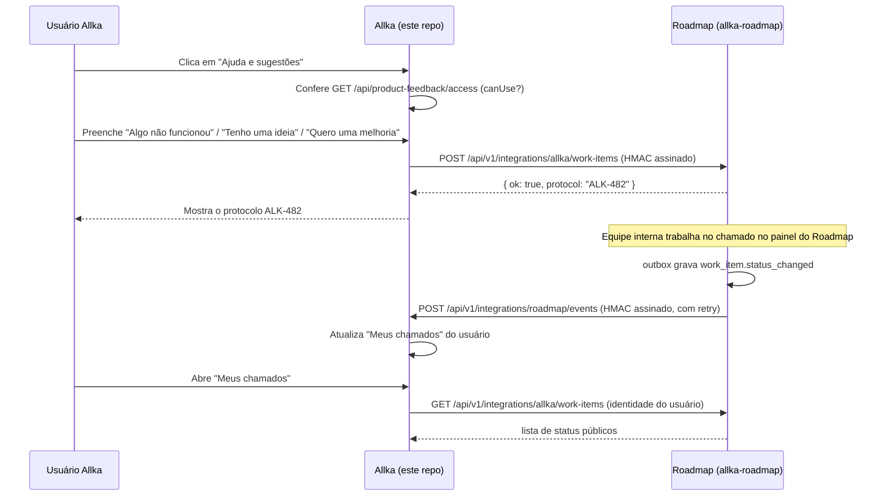

# Contrato de integração Allka ↔ Roadmap — v1.3.0

Status: **criação/consulta de chamados (Lote 1) em produção/QA, testado ponta a ponta local e
online.** O handoff de SSO para a equipe interna (seção 11) corrige nesta versão uma contradição
de permissão (o item não depende mais de `role=admin`, seção 11.2), separa o segredo técnico do
SSO do de criação de chamados (seção 11.6) e adiciona o salto `/sso/await` contra corrida com o
Basic Auth (seção 11.7) — implementado e testado localmente com automação de navegador real; o
deploy em QA/produção segue o plano de rollout na seção 12/13 dos changelogs de deploy, não
coberto por este documento (ver `entregas/` e os workflows de CI/CD dos dois repositórios).

Este documento é o espelho versionado, com os mesmos schemas, de
`allka-roadmap/docs/integration-contract-v1.md`. Ao alterar um lado, altere o outro e suba
`CONTRACT_VERSION` junto. Uma cópia anterior deste texto também existe em
`entregas/CONTRATO-INTEGRACAO-ROADMAP-V1.md`; aquele arquivo não é mais atualizado — `docs/` é
a fonte versionada.

## 1. Visão geral



## 2. Identidade e autenticação

- O usuário comum **nunca autentica no Roadmap**. Ele só tem sessão na Allka.
- A Allka é a origem confiável: ela chama o Roadmap servidor-a-servidor, informando a
  `externalUserId` (identidade estável do usuário Allka) — nunca um cookie, JWT ou senha.
- Toda chamada servidor-a-servidor é assinada com **HMAC-SHA256** sobre o corpo bruto da
  requisição, com um timestamp no cabeçalho e uma janela de tolerância curta (proteção contra
  replay). Os nomes de secret já estão reservados desde `allka-roadmap/docs/DEPLOY-QA.md`:
  `QA_ALLKA_HMAC_KEY_ID`, `QA_ALLKA_HMAC_SECRET` (e os equivalentes de produção, quando existirem).
- Para a equipe interna (Owner/Admin/Developer/QA), o plano futuro é **SSO de curta duração /
  JIT** usando a mesma identidade externa da Allka — mantendo uma conta Owner local só para
  emergência (perda de acesso ao SSO). Sem SSO configurado, o login local por e-mail/senha do
  Roadmap continua sendo o único caminho, como é hoje.
- Nunca há compartilhamento de cookie, sessão ou JWT bruto entre as duas aplicações.

## 3. Versionamento

- Prefixo de rota: `/api/v1/integrations/...`.
- `CONTRACT_VERSION` (hoje `1.0.0`) é exportado pelos dois módulos de schema. Mudança
  incompatível de schema = nova major (`/api/v2/...`); campo novo opcional = minor; correção de
  texto/descrição = patch.
- Um endpoint `v1` nunca deve ser removido silenciosamente — precisa de depreciação anunciada e
  de um período em que `v1` e `v2` respondem em paralelo.

## 4. Criação contextual (Allka → Roadmap)

`POST /api/v1/integrations/allka/work-items` (implementado — ver
`allka-roadmap/apps/backend/src/routes/integrations/allka-work-items.ts`)

Schema: `WorkItemContextualCreateRequestSchema`.

Campos:

| Campo | Obrigatório | Descrição |
|---|---|---|
| `idempotencyKey` | sim | UUID gerado pelo cliente; reenvio com a mesma chave nunca duplica o chamado |
| `correlationId` | sim | UUID para rastrear a requisição nos logs dos dois lados |
| `type` | sim | `PROBLEM` \| `IDEA` \| `IMPROVEMENT` — vocabulário público, menor que o interno (`WorkItemType` tem 10 valores) |
| `title`, `description` | sim | Texto livre do usuário |
| `identity.externalUserId` | sim | Identidade estável do usuário Allka |
| `identity.externalWorkspaceContext` | não | `companyId`/`agencyId`/`portal`, quando fizer sentido |
| `page.pathname` | sim | Rota **sanitizada** — sem querystring sensível, sem fragmento |
| `page.pageTitle`, `page.frontendVersion` | não | Título da tela e versão/commit do frontend Allka |
| `page.environment` | sim | `production` \| `qa` \| `local` — nomes alinhados ao ambiente real deste projeto (o ambiente de teste chama-se QA aqui, não "homolog") |
| `steps`, `expectedResult`, `actualResult`, `impact` | não | Mesmo vocabulário já usado no formulário interno do Roadmap |
| `attachment` | não | Referência a um arquivo **já enviado** separadamente (nunca base64 inline aqui) |

Resposta: `WorkItemContextualCreateResponseSchema` → `{ ok: true, protocol: "ALK-123" }`.

### Nunca enviar neste payload (nem em nenhum outro desta integração)

- cookie, JWT ou senha;
- `localStorage`/`sessionStorage` completos;
- valor de campos de formulário que não sejam os campos do próprio chamado;
- fragmento da URL (`#...`);
- query params sensíveis (token, e-mail em texto claro na URL, etc.);
- screenshot automática sem uma ação explícita do usuário.

## 5. Consulta e status (Allka → Roadmap, em nome do usuário logado)

`GET /api/v1/integrations/allka/work-items` (lista, paginada por `cursor` ou filtrada por
`updatedSince`) e `GET /api/v1/integrations/allka/work-items/:protocol` (item único).

Schemas: `WorkItemListQuerySchema`, `WorkItemPublicStatusSchema`.

- O usuário comum só pode consultar itens cuja `identity.externalUserId` seja a dele — a Allka
  nunca repassa um `externalUserId` diferente do usuário autenticado na sessão que fez a chamada.
- `status` usa um vocabulário público menor (`RECEIVED`, `IN_PROGRESS`, `IN_VALIDATION`,
  `RESOLVED`, `REOPENED`, `CANCELLED`) — os 15 status internos do Kanban (`TRIAGE`,
  `IN_REVIEW`, `AWAITING_DEPLOY` etc.) nunca vazam para essa view pública.
- `publicComments` são comentários marcados como públicos pela equipe — as anotações internas
  do chamado nunca aparecem aqui.

## 6. Eventos duráveis (outbox nos dois lados)

Schema: `IntegrationEventEnvelopeSchema`, tipos em `IntegrationEventTypeSchema`:
`work_item.created`, `work_item.updated`, `work_item.status_changed`, `work_item.resolved`,
`work_item.reopened`, `release.published`.

- Cada lado grava o evento em uma tabela outbox local **antes** de tentar entregá-lo — a entrega
  é assíncrona e nunca bloqueia a operação que gerou o evento.
- Entrega assinada por HMAC, com `eventId` (UUID) usado para idempotência do lado que recebe —
  reprocessar o mesmo `eventId` nunca duplica efeito.
- Retry com backoff exponencial; falhas de entrega ficam registradas em log **sem guardar
  secrets nem o corpo assinado**.
- Nenhum dos dois lados grava diretamente no banco do outro — toda mudança de estado passa pela
  API assinada.

## 7. GitHub e deploy (informativo, nunca fecha sozinho)

Schema: `GithubLinkEventSchema` — reconhece o protocolo `ALK-123` em título/corpo de PR ou
mensagem de commit.

- PR aberto → atualiza o vínculo e o estágio técnico do chamado (ex.: "em revisão").
- PR mergeado → avança o estágio técnico, mas **não fecha o chamado sozinho**.
- Deploy bem-sucedido → pode mover para "aguardando validação".
- **`DONE` sempre exige `solutionSummary` preenchido e evidência de validação da QA registrada**
  — nunca é automático só por causa de um merge ou deploy.
- Reabertura sempre volta o item para a fila e preserva todo o histórico anterior — nada é
  apagado.

## 8. Códigos de erro

`IntegrationErrorResponseSchema` — `{ ok: false, code, message }`:

| Código | Quando acontece |
|---|---|
| `INVALID_PAYLOAD` | corpo não bate com o schema Zod |
| `INVALID_SIGNATURE` | HMAC ausente, incorreto ou fora da janela de tempo aceita |
| `IDEMPOTENCY_CONFLICT` | mesma `idempotencyKey` com corpo diferente do original |
| `UNKNOWN_EXTERNAL_USER` | `externalUserId` não reconhecido pelo Roadmap |
| `RATE_LIMITED` | limite de requisições por identidade/origem excedido |
| `INTEGRATION_DISABLED` | feature flag técnica desligada (ver `entregas/ADENDO-COPILOT-CONTROLE-DE-ACESSO-AO-BOTAO-DE-CHAMADOS.md`) |

## 9. Compatibilidade e testes de contrato

- `apps/backend/src/contracts/allka-integration.ts` (allka-roadmap) é a fonte da verdade dos
  schemas Zod; `apps/backend/src/lib/roadmap-integration-contract.ts` (este repo) espelha as
  mesmas formas — comparados campo a campo antes de cada mudança.
- allka-roadmap valida com vitest em `allka-integration.contract.test.ts`
  (`npm run test:unit --workspace apps/backend`).
- Este repo agora também tem um teste de contrato real:
  `apps/backend/src/lib/roadmap-integration-contract.test.ts`, usando `node:test` +
  `node:assert/strict` via `tsx --test` — sem instalar um framework de teste novo, já que
  `apps/backend` aqui não tinha nenhum configurado. Rodar com:
  `npm run test:roadmap-contract --workspace apps/backend`.
- Os dois arquivos de teste usam os mesmos exemplos válidos/inválidos (mesmo protocolo `ALK-123`,
  mesma rejeição de campo extra por `.strict()`, mesma rejeição de `homolog` em favor de `qa`)
  para que uma mudança de contrato precise passar nos dois lados.

## 10. O que este contrato NÃO cobre ainda

- Outbox e eventos duráveis — "Meus chamados" hoje atualiza por consulta manual e polling de
  ~30s enquanto a tela está aberta, não por webhook.
- Vínculo com GitHub/deploy.
- Anexo/screenshot no formulário da Allka.
- SSO real só existe hoje para a equipe interna (Owner/Admin/Developer/QA, ver seção 11) — não
  existe para o usuário comum, que continua sem login nenhum no Roadmap (por design, seção 2).

O que já existe e funciona (Lote 1): as três rotas de integração no Roadmap, assinatura HMAC
v1.1.0, idempotência, e do lado Allka o controle de acesso (grupos/overrides/auditoria), o
cliente HTTP assinado, os endpoints `/api/product-feedback/*` e `/api/admin/product-feedback/*`,
o botão "Ajuda e sugestões", "Meus chamados" e a página `/admin/acesso-chamados`.

## 11. SSO handoff (Allka → Roadmap, equipe interna) — v1.3.0

Login único para quem já tem conta própria no Roadmap (`OWNER`/`ADMIN`/`DEVELOPER`/
`QA_REVIEWER`) com o **mesmo e-mail** de uma conta Allka autorizada: clicar em "Roadmap e
chamados" (sidebar, qualquer `account_type`) ou "Abrir painel interno" (`/admin/acesso-chamados`)
abre o Roadmap já autenticado, sem digitar senha de novo. Reaproveita a infraestrutura HMAC do
resto deste contrato, com um segredo próprio (seção 11.6) — não é OAuth/JWT federado, é um token
de handoff de uso único trocado por uma sessão normal do Roadmap.

**v1.3.0 corrige uma contradição real da v1.2.0**: o item da sidebar e o pedido de handoff eram
gateados por `role=admin` além da permissão granular — o que contradizia a própria promessa de
"central_chamados libera um não-admin". A partir desta versão, **nada aqui depende de
`role`/`account_type`** — só da permissão granular (seção 11.2). v1.3.0 também acrescenta um
passo intermediário (`/sso/await`) para o token nunca correr risco de expirar durante o primeiro
Basic Auth (seção 11.7) e separa o segredo técnico do SSO do segredo de criação de chamados
(seção 11.6).

```mermaid
sequenceDiagram
    participant U as Usuário Allka autorizado (qualquer conta)
    participant AF as Allka (nova aba)
    participant AB as Allka backend
    participant RB as Roadmap backend
    participant RF as Roadmap (/sso/await → SsoConsumePage)

    U->>AF: Clica "Roadmap e chamados" (sidebar) ou "Abrir painel interno"
    AF->>AF: window.open("about:blank") — síncrono, dentro do clique
    AF->>AB: GET /api/product-feedback/roadmap-sso/base-url
    AB-->>AF: { roadmapInternalUrl }
    AF->>RF: popup.location.href = roadmapInternalUrl + "/sso/await?origin=..."
    Note over RF: Basic Auth do Caddy resolve aqui, ANTES de qualquer token existir
    RF->>AF: postMessage({type:"allka-roadmap-sso-ready"}) para window.opener
    AF->>AB: POST /api/product-feedback/roadmap-sso/start
    AB->>AB: evaluateRoadmapSsoAccess(accountType, perfil) — sem checar role
    AB->>RB: POST /api/v1/integrations/allka/sso/tickets { email } (HMAC, segredo dedicado)
    RB->>RB: Busca User por email; exige active + role elegível
    alt não elegível
        RB-->>AB: 404 NOT_ELIGIBLE
        AB-->>AF: 404/503 (mensagem genérica e amigável)
        AF->>AF: fecha a aba
    else elegível
        RB->>RB: cria SsoHandoffTicket (hash do token, expira em 60s a partir de AGORA)
        RB-->>AB: { ok:true, ssoToken }
        AB-->>AF: { redirectUrl: ROADMAP_INTERNAL_URL + "/sso/consume?token=..." }
        AF->>RF: popup.location.href = redirectUrl (mesma aba, Basic Auth já resolvido)
        RF->>RF: window.opener = null; strip token da URL (history.replaceState)
        RF->>RB: POST /auth/sso/consume { token }
        RB->>RB: updateMany(consumedAt=null → agora) — só ganha quem chegar primeiro
        RB->>RB: revalida active + role elegível (não só no momento da emissão)
        RB-->>RF: 200 + cookies de sessão normais do Roadmap
        RF->>RF: navega para "/" já autenticado
    end
```

### 11.1 Endpoints

| Endpoint | Lado | Autenticação | Descrição |
|---|---|---|---|
| `GET /api/product-feedback/roadmap-sso/base-url` | Allka | sessão Allka + `evaluateRoadmapSsoAccess` | URL pública do Roadmap, para navegar a aba ANTES de pedir o token (seção 11.7) |
| `POST /api/product-feedback/roadmap-sso/start` | Allka | sessão Allka + `evaluateRoadmapSsoAccess` (nunca `role=admin`) | Pede ao Roadmap um token de handoff para o e-mail do usuário logado; devolve `redirectUrl` |
| `POST /api/v1/integrations/allka/sso/tickets` | Roadmap | HMAC, **segredo dedicado** (seção 11.6), mesmo esquema de `/allka/work-items` | Emite o token de 60s se o e-mail bater com uma conta ativa e elegível |
| `POST /auth/sso/consume` | Roadmap | nenhuma (o token É a prova) | Troca o token por uma sessão normal do Roadmap (mesmos cookies do `/auth/login`) |
| `GET /sso/await` (Roadmap, página pública) | Roadmap | Basic Auth do Caddy (camada externa) | Página token-less que só confirma, via `postMessage`, que o Basic Auth já foi resolvido |

Note que as duas rotas do lado Allka moveram de `/api/admin/product-feedback/...` (v1.2.0) para
`/api/product-feedback/...` — deliberado: viviam sob o router `product-feedback-admin.ts`, que
exige `role=admin` para TODA rota; agora vivem em `routes/roadmap-sso.ts`, um router próprio,
gated só por `evaluateRoadmapSsoAccess`.

### 11.2 Quem pode pedir / quem pode entrar

- **Pedir** (`roadmap-sso/base-url` e `roadmap-sso/start`): qualquer usuário Allka autenticado,
  **de qualquer `account_type`**, para quem `evaluateRoadmapSsoAccess(accountType, perfil)` seja
  verdadeiro. Essa função (não a genérica `requireAnyPermission`) tem uma regra deliberadamente
  assimétrica:
  - módulo **`sistema`** só libera quando `accountType === "admin"` — é o grandfather legado
    (perfil ausente/inativo/`is_master` → libera), que já vale para todo outro
    `requirePermission("sistema", ...)` da plataforma. Nunca se aplica a `empresas`/`agencias`/
    `nomades`/`lider`.
  - módulo **`central_chamados`** **nunca** tem grandfather, para nenhum `account_type` —
    sempre exige um `AdminProfile` ativo com a permissão explícita (ou `is_master=true`). É assim
    que um `account_type` não-admin (um desenvolvedor ou revisor QA que loga como `empresas`,
    `agencias` etc.) pode ganhar acesso sem que isso abra a porta pra qualquer conta comum sem
    perfil (a esmagadora maioria da base).
  - Nunca uma checagem de string no nome do papel/role.
- **Entrar de fato** (`sso/consume`): só `User.role` do Roadmap em `OWNER`, `ADMIN`, `DEVELOPER`
  ou `QA_REVIEWER`, `active=true`, `email` idêntico ao da conta Allka que pediu. `REQUESTER` e
  `VIEWER` nunca são elegíveis. **Nunca cria nem promove conta** — se não existir uma conta
  Roadmap com aquele e-mail e papel elegível, o pedido falha com uma mensagem genérica
  (`NOT_ELIGIBLE`), sem revelar se o e-mail existe com outro papel ou não existe de jeito nenhum.
- **Conceder `central_chamados`**: `/admin/acesso-chamados` tem um painel dedicado
  (`central-chamados-admin.ts`, gated por `role=admin` + `sistema.edit` — só quem já tem o
  módulo largo pode conceder o estreito) com busca, seleção em lote, confirmação e auditoria. Por
  usuário e perfil ser 1:1 no schema (`User.admin_profile_id`), conceder atribui um perfil
  dedicado único ("Acesso — Central de Roadmap", só com `central_chamados/view`) — se o usuário
  já tiver outro perfil, o pedido é recusado com uma mensagem clara em vez de trocar silenciosamente.

### 11.3 Propriedades do token

- **Validade: 60 segundos**, contados a partir da emissão (`SsoHandoffTicket.expiresAt`), fixado
  no servidor independente do que o chamador pedir.
- **Uso único**: reivindicado atomicamente (`updateMany` com `consumedAt: null` na cláusula
  `WHERE`) — a segunda tentativa com o mesmo token sempre perde, mesmo em corrida.
- **Nonce**: o próprio token (32 bytes aleatórios, hex) — só o hash SHA-256 fica no banco, igual
  às sessões normais (`hashSessionToken`).
- **Finalidade**: `SsoHandoffTicket` é uma tabela dedicada só para este handoff (não reaproveita
  `PasswordResetToken` nem `Session`) — a finalidade é garantida estruturalmente por não existir
  nenhum outro código que crie ou consuma linhas nela, em vez de um campo `purpose` redundante.
- **Emissor**: verificado pela assinatura HMAC de `/allka/sso/tickets` — só a Allka (dona do
  segredo compartilhado) consegue pedir um token.
- **Destinatário**: o token é vinculado a um `userId` específico no momento da emissão; o
  `/auth/sso/consume` revalida `active` e o papel elegível de novo no momento do consumo (a
  janela de 60s é curta, mas não zero).

### 11.4 Respostas de erro

| Código | Endpoint | Quando |
|---|---|---|
| `400` | ambos | corpo inválido (e-mail malformado, token ausente/curto) |
| `401` | `sso/consume` | token inexistente, expirado ou já consumido — mensagem: "Link de acesso expirado ou já utilizado. Faça login normalmente." |
| `401` | `sso/consume` | conta ficou inativa/não-elegível entre a emissão e o consumo |
| `403` | `roadmap-sso/base-url`, `roadmap-sso/start` | `evaluateRoadmapSsoAccess` retornou falso para a conta logada (seção 11.2) |
| `404` | `sso/tickets` | e-mail sem conta Roadmap elegível (`NOT_ELIGIBLE`, mensagem genérica) |
| `409` | `sso/consume` | corrida perdida (outra requisição já consumiu o mesmo token no meio-tempo) — mesma resposta 401 genérica acima, não distingue de "expirado" |
| `503`/502 | `roadmap-sso/start` | Roadmap fora do ar, `ROADMAP_INTERNAL_URL` não configurada, ou integração técnica desligada — mensagem amigável: "Não foi possível abrir a Central de roadmap e chamados. Tente novamente." |

### 11.5 Auditoria

- `sso.ticket_issued` (Roadmap, `AuditLog`) — ao emitir o token; grava só `userId`, nunca o
  token nem o e-mail em texto livre no `details`.
- `sso.allka_login` (Roadmap, `AuditLog`) — ao consumir com sucesso; mesmo formato de
  `login.success`.
- `roadmap_sso.started` (Allka, `ProductFeedbackAccessAudit`) — ao pedir o handoff, pelo mesmo
  `writeAccessAudit` já usado pelo resto de `/admin/acesso-chamados`.
- `central_chamados.granted` / `central_chamados.revoked` (Allka, `ProductFeedbackAccessAudit`)
  — ao conceder/revogar o módulo pelo painel de `/admin/acesso-chamados` (individual ou em lote);
  grava quem concedeu, para quem, e o motivo opcional digitado na confirmação. Aparece na mesma
  seção "Auditoria" da página, sem UI separada.
- Nenhum log, em nenhum dos dois lados, grava o token completo ou a assinatura HMAC recebida.

### 11.6 Segredo técnico

**v1.3.0 separa o segredo do SSO do segredo de criação de chamados** — na v1.2.0 os dois
reaproveitavam o mesmo par `ROADMAP_HMAC_KEY_ID`/`ROADMAP_HMAC_SECRET` (Allka) /
`ALLKA_HMAC_KEY_ID`/`ALLKA_HMAC_SECRET` (Roadmap). A decisão original partia da premissa de que
"é o mesmo backend confiável dos dois lados, então não reduz o raio de explosão real separar" —
mas login de sessão (SSO) e criação de registro (`work-items`) são operações de sensibilidade
diferente o suficiente para não valer a pena continuar arriscando: um vazamento do par de
`work-items` (usado em mais integrações, mais superfície) não deveria também permitir logar como
qualquer desenvolvedor/QA do Roadmap.

- **Novo par dedicado**: `ROADMAP_SSO_HMAC_KEY_ID`/`ROADMAP_SSO_HMAC_SECRET` (Allka, ao assinar
  `POST .../allka/sso/tickets`) e `ALLKA_SSO_HMAC_KEY_ID`/`ALLKA_SSO_HMAC_SECRET` (Roadmap, ao
  verificar essa mesma rota). Só essa rota usa este par; `/allka/work-items` continua no par base.
- **Fallback automático, sem downtime**: se o par dedicado não estiver setado num ambiente,
  `config.ts` (dos dois lados) cai de volta pro par base (`ssoKeyId: env.ALLKA_SSO_HMAC_KEY_ID ||
  env.ALLKA_HMAC_KEY_ID`). Isso significa que introduzir ou rotacionar o par dedicado é uma pura
  mudança de configuração — a integração nunca fica fora do ar entre "só o par base existe" e "o
  par dedicado passou a existir" nos dois ambientes.
- **Nunca publicados**: os valores reais foram gerados com `openssl rand -hex 32`, setados via
  `gh secret set` (GitHub Actions, write-only) e no `.env` local (gitignored) de cada repo;
  verificados batendo entre os dois lados por hash SHA-256, nunca em texto puro em log, commit ou
  neste documento.
- **Roteamento**: a rota de SSO do lado Roadmap foi movida para um router próprio, montado num
  prefixo mais específico (`.../allka/sso`, registrado antes de `.../allka`) — ver a lição de
  roteamento abaixo.

**Lição de roteamento (causa raiz de um bug real deste round)**: montar dois routers Express no
MESMO prefixo (`.../allka`) faz o `router.use()` do primeiro interceptar toda requisição que bate
no prefixo, mesmo que a rota específica só exista no segundo router — o `/sso/tickets` estava
sendo verificado (e rejeitado) pelo middleware HMAC do router de `work-items`, com o par de
segredo errado, antes de o router de SSO ser sequer alcançado. A correção definitiva foi montar o
router de SSO num prefixo estritamente mais específico e não sobreposto (`.../allka/sso`), e não
qualquer ajuste de segredo ou de ordem de import.

### 11.7 Fluxo de dois saltos (`/sso/await`) — evita a corrida com o Basic Auth

O ambiente do Roadmap fica atrás de Basic Auth (Caddy), uma camada de rede externa ao aplicativo.
Antes da v1.3.0, o primeiro acesso de um usuário nunca autenticado no navegador contra aquele
domínio corria o risco de consumir os 60 segundos de validade do token de SSO enquanto o usuário
ainda estava digitando a credencial do Basic Auth (que É diferente da senha da conta Roadmap) —
o token podia expirar antes mesmo de a página de consumo carregar.

A solução não foi aumentar a validade do token (fixada deliberadamente curta, seção 11.3) nem
remover o Basic Auth (camada de proteção externa e independente da aplicação). Em vez disso, o
clique passou a abrir a aba num salto intermediário, ANTES de pedir qualquer token:

1. A aba nova navega direto para `{ROADMAP_INTERNAL_URL}/sso/await?origin=...` — uma página
   pública e sem token do Roadmap. O Basic Auth do Caddy resolve aqui (browser já teria essa
   credencial em cache depois do primeiro uso; se não tiver, o usuário digita agora, sem pressão
   de tempo nenhuma, porque não existe token ainda).
2. Só depois de `/sso/await` carregar (o que garante que o Basic Auth já passou) é que ela avisa
   a aba original via `postMessage` (`{type:"allka-roadmap-sso-ready"}`, validando `origin` e
   `event.source` dos dois lados).
3. Só então a Allka pede o token (`roadmap-sso/start`) e navega a MESMA aba (já autenticada pelo
   Basic Auth) para `/sso/consume?token=...` — os 60 segundos do token só começam a correr depois
   que a única parte fora do controle da aplicação (o Basic Auth) já foi resolvida.

Isso também elimina popup-blockers: o `window.open("about:blank")` acontece de forma síncrona
dentro do clique original (antes de qualquer `await`), e a mesma referência de aba é reaproveitada
nos dois saltos via `tab.location.href`.

### 11.8 O que ainda falta

- `central_chamados` concede um perfil `AdminProfile` dedicado por ser 1:1 usuário↔perfil no
  schema atual — um usuário que precise de `central_chamados` **e** de outro módulo ao mesmo
  tempo não é atendido pelo painel de `/admin/acesso-chamados` hoje (precisaria editar o perfil
  dele diretamente em `/admin/permissoes`). Só um modelo de permissões muitos-para-muitos
  resolveria isso de vez.
- `/sso/await` depende do `postMessage` chegar — se o usuário tiver bloqueado popups/scripts de
  terceiros de forma agressiva o suficiente para quebrar `window.opener`, o fluxo cai no timeout
  de 5 minutos com uma mensagem genérica, sem uma alternativa por polling ainda.
