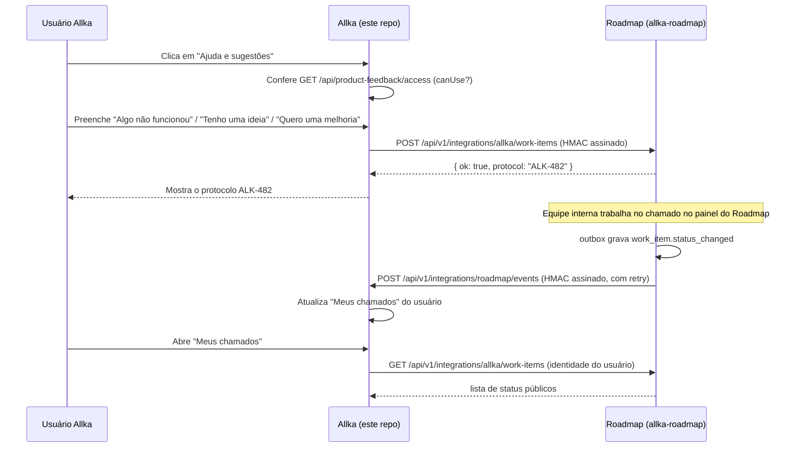

# Contrato de integração Allka ↔ Roadmap — v1.2.0

Status: **criação/consulta de chamados (Lote 1) em produção/QA, testado ponta a ponta local e
online.** O handoff de SSO para a equipe interna (seção 11) é novo nesta versão — implementado e
testado localmente; o deploy em QA/produção segue o plano de rollout na seção 12/13 dos changelogs
de deploy, não coberto por este documento (ver `entregas/` e os workflows de CI/CD dos dois
repositórios).

Este documento é o espelho versionado, com os mesmos schemas, de
`allka-roadmap/docs/integration-contract-v1.md`. Ao alterar um lado, altere o outro e suba
`CONTRACT_VERSION` junto. Uma cópia anterior deste texto também existe em
`entregas/CONTRATO-INTEGRACAO-ROADMAP-V1.md`; aquele arquivo não é mais atualizado — `docs/` é
a fonte versionada.

## 1. Visão geral



## 2. Identidade e autenticação

- O usuário comum **nunca autentica no Roadmap**. Ele só tem sessão na Allka.
- A Allka é a origem confiável: ela chama o Roadmap servidor-a-servidor, informando a
  `externalUserId` (identidade estável do usuário Allka) — nunca um cookie, JWT ou senha.
- Toda chamada servidor-a-servidor é assinada com **HMAC-SHA256** sobre o corpo bruto da
  requisição, com um timestamp no cabeçalho e uma janela de tolerância curta (proteção contra
  replay). Os nomes de secret já estão reservados desde `allka-roadmap/docs/DEPLOY-QA.md`:
  `QA_ALLKA_HMAC_KEY_ID`, `QA_ALLKA_HMAC_SECRET` (e os equivalentes de produção, quando existirem).
- Para a equipe interna (Owner/Admin/Developer/QA), o plano futuro é **SSO de curta duração /
  JIT** usando a mesma identidade externa da Allka — mantendo uma conta Owner local só para
  emergência (perda de acesso ao SSO). Sem SSO configurado, o login local por e-mail/senha do
  Roadmap continua sendo o único caminho, como é hoje.
- Nunca há compartilhamento de cookie, sessão ou JWT bruto entre as duas aplicações.

## 3. Versionamento

- Prefixo de rota: `/api/v1/integrations/...`.
- `CONTRACT_VERSION` (hoje `1.0.0`) é exportado pelos dois módulos de schema. Mudança
  incompatível de schema = nova major (`/api/v2/...`); campo novo opcional = minor; correção de
  texto/descrição = patch.
- Um endpoint `v1` nunca deve ser removido silenciosamente — precisa de depreciação anunciada e
  de um período em que `v1` e `v2` respondem em paralelo.

## 4. Criação contextual (Allka → Roadmap)

`POST /api/v1/integrations/allka/work-items` (implementado — ver
`allka-roadmap/apps/backend/src/routes/integrations/allka-work-items.ts`)

Schema: `WorkItemContextualCreateRequestSchema`.

Campos:

| Campo | Obrigatório | Descrição |
|---|---|---|
| `idempotencyKey` | sim | UUID gerado pelo cliente; reenvio com a mesma chave nunca duplica o chamado |
| `correlationId` | sim | UUID para rastrear a requisição nos logs dos dois lados |
| `type` | sim | `PROBLEM` \| `IDEA` \| `IMPROVEMENT` — vocabulário público, menor que o interno (`WorkItemType` tem 10 valores) |
| `title`, `description` | sim | Texto livre do usuário |
| `identity.externalUserId` | sim | Identidade estável do usuário Allka |
| `identity.externalWorkspaceContext` | não | `companyId`/`agencyId`/`portal`, quando fizer sentido |
| `page.pathname` | sim | Rota **sanitizada** — sem querystring sensível, sem fragmento |
| `page.pageTitle`, `page.frontendVersion` | não | Título da tela e versão/commit do frontend Allka |
| `page.environment` | sim | `production` \| `qa` \| `local` — nomes alinhados ao ambiente real deste projeto (o ambiente de teste chama-se QA aqui, não "homolog") |
| `steps`, `expectedResult`, `actualResult`, `impact` | não | Mesmo vocabulário já usado no formulário interno do Roadmap |
| `attachment` | não | Referência a um arquivo **já enviado** separadamente (nunca base64 inline aqui) |

Resposta: `WorkItemContextualCreateResponseSchema` → `{ ok: true, protocol: "ALK-123" }`.

### Nunca enviar neste payload (nem em nenhum outro desta integração)

- cookie, JWT ou senha;
- `localStorage`/`sessionStorage` completos;
- valor de campos de formulário que não sejam os campos do próprio chamado;
- fragmento da URL (`#...`);
- query params sensíveis (token, e-mail em texto claro na URL, etc.);
- screenshot automática sem uma ação explícita do usuário.

## 5. Consulta e status (Allka → Roadmap, em nome do usuário logado)

`GET /api/v1/integrations/allka/work-items` (lista, paginada por `cursor` ou filtrada por
`updatedSince`) e `GET /api/v1/integrations/allka/work-items/:protocol` (item único).

Schemas: `WorkItemListQuerySchema`, `WorkItemPublicStatusSchema`.

- O usuário comum só pode consultar itens cuja `identity.externalUserId` seja a dele — a Allka
  nunca repassa um `externalUserId` diferente do usuário autenticado na sessão que fez a chamada.
- `status` usa um vocabulário público menor (`RECEIVED`, `IN_PROGRESS`, `IN_VALIDATION`,
  `RESOLVED`, `REOPENED`, `CANCELLED`) — os 15 status internos do Kanban (`TRIAGE`,
  `IN_REVIEW`, `AWAITING_DEPLOY` etc.) nunca vazam para essa view pública.
- `publicComments` são comentários marcados como públicos pela equipe — as anotações internas
  do chamado nunca aparecem aqui.

## 6. Eventos duráveis (outbox nos dois lados)

Schema: `IntegrationEventEnvelopeSchema`, tipos em `IntegrationEventTypeSchema`:
`work_item.created`, `work_item.updated`, `work_item.status_changed`, `work_item.resolved`,
`work_item.reopened`, `release.published`.

- Cada lado grava o evento em uma tabela outbox local **antes** de tentar entregá-lo — a entrega
  é assíncrona e nunca bloqueia a operação que gerou o evento.
- Entrega assinada por HMAC, com `eventId` (UUID) usado para idempotência do lado que recebe —
  reprocessar o mesmo `eventId` nunca duplica efeito.
- Retry com backoff exponencial; falhas de entrega ficam registradas em log **sem guardar
  secrets nem o corpo assinado**.
- Nenhum dos dois lados grava diretamente no banco do outro — toda mudança de estado passa pela
  API assinada.

## 7. GitHub e deploy (informativo, nunca fecha sozinho)

Schema: `GithubLinkEventSchema` — reconhece o protocolo `ALK-123` em título/corpo de PR ou
mensagem de commit.

- PR aberto → atualiza o vínculo e o estágio técnico do chamado (ex.: "em revisão").
- PR mergeado → avança o estágio técnico, mas **não fecha o chamado sozinho**.
- Deploy bem-sucedido → pode mover para "aguardando validação".
- **`DONE` sempre exige `solutionSummary` preenchido e evidência de validação da QA registrada**
  — nunca é automático só por causa de um merge ou deploy.
- Reabertura sempre volta o item para a fila e preserva todo o histórico anterior — nada é
  apagado.

## 8. Códigos de erro

`IntegrationErrorResponseSchema` — `{ ok: false, code, message }`:

| Código | Quando acontece |
|---|---|
| `INVALID_PAYLOAD` | corpo não bate com o schema Zod |
| `INVALID_SIGNATURE` | HMAC ausente, incorreto ou fora da janela de tempo aceita |
| `IDEMPOTENCY_CONFLICT` | mesma `idempotencyKey` com corpo diferente do original |
| `UNKNOWN_EXTERNAL_USER` | `externalUserId` não reconhecido pelo Roadmap |
| `RATE_LIMITED` | limite de requisições por identidade/origem excedido |
| `INTEGRATION_DISABLED` | feature flag técnica desligada (ver `entregas/ADENDO-COPILOT-CONTROLE-DE-ACESSO-AO-BOTAO-DE-CHAMADOS.md`) |

## 9. Compatibilidade e testes de contrato

- `apps/backend/src/contracts/allka-integration.ts` (allka-roadmap) é a fonte da verdade dos
  schemas Zod; `apps/backend/src/lib/roadmap-integration-contract.ts` (este repo) espelha as
  mesmas formas — comparados campo a campo antes de cada mudança.
- allka-roadmap valida com vitest em `allka-integration.contract.test.ts`
  (`npm run test:unit --workspace apps/backend`).
- Este repo agora também tem um teste de contrato real:
  `apps/backend/src/lib/roadmap-integration-contract.test.ts`, usando `node:test` +
  `node:assert/strict` via `tsx --test` — sem instalar um framework de teste novo, já que
  `apps/backend` aqui não tinha nenhum configurado. Rodar com:
  `npm run test:roadmap-contract --workspace apps/backend`.
- Os dois arquivos de teste usam os mesmos exemplos válidos/inválidos (mesmo protocolo `ALK-123`,
  mesma rejeição de campo extra por `.strict()`, mesma rejeição de `homolog` em favor de `qa`)
  para que uma mudança de contrato precise passar nos dois lados.

## 10. O que este contrato NÃO cobre ainda

- Outbox e eventos duráveis — "Meus chamados" hoje atualiza por consulta manual e polling de
  ~30s enquanto a tela está aberta, não por webhook.
- Vínculo com GitHub/deploy.
- Anexo/screenshot no formulário da Allka.
- SSO real só existe hoje para a equipe interna (Owner/Admin/Developer/QA, ver seção 11) — não
  existe para o usuário comum, que continua sem login nenhum no Roadmap (por design, seção 2).

O que já existe e funciona (Lote 1): as três rotas de integração no Roadmap, assinatura HMAC
v1.1.0, idempotência, e do lado Allka o controle de acesso (grupos/overrides/auditoria), o
cliente HTTP assinado, os endpoints `/api/product-feedback/*` e `/api/admin/product-feedback/*`,
o botão "Ajuda e sugestões", "Meus chamados" e a página `/admin/acesso-chamados`.

## 11. SSO handoff (Allka → Roadmap, equipe interna) — v1.2.0

Login único para quem já tem conta própria no Roadmap (`OWNER`/`ADMIN`/`DEVELOPER`/
`QA_REVIEWER`) com o **mesmo e-mail** de uma conta admin da Allka: clicar em "Roadmap e
chamados" (sidebar) ou "Abrir painel interno" (`/admin/acesso-chamados`) abre o Roadmap já
autenticado, sem digitar senha de novo. Reaproveita a mesma infraestrutura HMAC do resto deste
contrato — não é OAuth/JWT federado, é um token de handoff de uso único trocado por uma sessão
normal do Roadmap.

```mermaid
sequenceDiagram
    participant U as Admin Allka (staff)
    participant AF as Allka (nova aba)
    participant AB as Allka backend
    participant RB as Roadmap backend
    participant RF as Roadmap (SsoConsumePage)

    U->>AF: Clica "Roadmap e chamados" (sidebar) ou "Abrir painel interno"
    AF->>AF: window.open("about:blank") — síncrono, dentro do clique
    AF->>AB: POST /api/admin/product-feedback/roadmap-sso/start
    AB->>AB: requireAnyPermission(sistema.view | central_chamados.view)
    AB->>RB: POST /api/v1/integrations/allka/sso/tickets { email } (HMAC assinado)
    RB->>RB: Busca User por email; exige active + role elegível
    alt não elegível
        RB-->>AB: 404 NOT_ELIGIBLE
        AB-->>AF: 404/502 (mensagem genérica e amigável)
        AF->>AF: fecha a aba em branco
    else elegível
        RB->>RB: cria SsoHandoffTicket (hash do token, expira em 60s)
        RB-->>AB: { ok:true, ssoToken }
        AB-->>AF: { redirectUrl: ROADMAP_INTERNAL_URL + "/sso/consume?token=..." }
        AF->>RF: popup.location.href = redirectUrl
        RF->>RF: window.opener = null; strip token da URL (history.replaceState)
        RF->>RB: POST /auth/sso/consume { token }
        RB->>RB: updateMany(consumedAt=null → agora) — só ganha quem chegar primeiro
        RB->>RB: revalida active + role elegível (não só no momento da emissão)
        RB-->>RF: 200 + cookies de sessão normais do Roadmap
        RF->>RF: navega para "/" já autenticado
    end
```

### 11.1 Endpoints

| Endpoint | Lado | Autenticação | Descrição |
|---|---|---|---|
| `POST /api/admin/product-feedback/roadmap-sso/start` | Allka | sessão Allka (`role=admin` + `requireAnyPermission(["sistema","view"], ["central_chamados","view"])`) | Pede ao Roadmap um token de handoff para o e-mail do admin logado; devolve `redirectUrl` |
| `POST /api/v1/integrations/allka/sso/tickets` | Roadmap | HMAC (mesmo esquema de `/allka/work-items`) | Emite o token de 60s se o e-mail bater com uma conta ativa e elegível |
| `POST /auth/sso/consume` | Roadmap | nenhuma (o token É a prova) | Troca o token por uma sessão normal do Roadmap (mesmos cookies do `/auth/login`) |

### 11.2 Quem pode pedir / quem pode entrar

- **Pedir** (`roadmap-sso/start`): qualquer usuário Allka com `role=admin` **e** a permissão
  granular `sistema.view` **ou** `central_chamados.view` (perfil `AdminProfile`/
  `AdminPermission` — nunca uma checagem de string no nome do papel). `central_chamados` é um
  módulo dedicado, administrado exatamente como `sistema` já é (linhas em `AdminPermission` via
  `POST`/`PUT /api/permissions`) — existe para o founder liberar devs/QA só para isto, sem dar o
  módulo `sistema` inteiro.
- **Entrar de fato** (`sso/consume`): só `User.role` do Roadmap em `OWNER`, `ADMIN`, `DEVELOPER`
  ou `QA_REVIEWER`, `active=true`, `email` idêntico ao da conta Allka que pediu. `REQUESTER` e
  `VIEWER` nunca são elegíveis. **Nunca cria nem promove conta** — se não existir uma conta
  Roadmap com aquele e-mail e papel elegível, o pedido falha com uma mensagem genérica
  (`NOT_ELIGIBLE`), sem revelar se o e-mail existe com outro papel ou não existe de jeito nenhum.

### 11.3 Propriedades do token

- **Validade: 60 segundos**, contados a partir da emissão (`SsoHandoffTicket.expiresAt`), fixado
  no servidor independente do que o chamador pedir.
- **Uso único**: reivindicado atomicamente (`updateMany` com `consumedAt: null` na cláusula
  `WHERE`) — a segunda tentativa com o mesmo token sempre perde, mesmo em corrida.
- **Nonce**: o próprio token (32 bytes aleatórios, hex) — só o hash SHA-256 fica no banco, igual
  às sessões normais (`hashSessionToken`).
- **Finalidade**: `SsoHandoffTicket` é uma tabela dedicada só para este handoff (não reaproveita
  `PasswordResetToken` nem `Session`) — a finalidade é garantida estruturalmente por não existir
  nenhum outro código que crie ou consuma linhas nela, em vez de um campo `purpose` redundante.
- **Emissor**: verificado pela assinatura HMAC de `/allka/sso/tickets` — só a Allka (dona do
  segredo compartilhado) consegue pedir um token.
- **Destinatário**: o token é vinculado a um `userId` específico no momento da emissão; o
  `/auth/sso/consume` revalida `active` e o papel elegível de novo no momento do consumo (a
  janela de 60s é curta, mas não zero).

### 11.4 Respostas de erro

| Código | Endpoint | Quando |
|---|---|---|
| `400` | ambos | corpo inválido (e-mail malformado, token ausente/curto) |
| `401` | `sso/consume` | token inexistente, expirado ou já consumido — mensagem: "Link de acesso expirado ou já utilizado. Faça login normalmente." |
| `401` | `sso/consume` | conta ficou inativa/não-elegível entre a emissão e o consumo |
| `403` | `roadmap-sso/start` | admin Allka sem `sistema.view` nem `central_chamados.view` |
| `404` | `sso/tickets` | e-mail sem conta Roadmap elegível (`NOT_ELIGIBLE`, mensagem genérica) |
| `409` | `sso/consume` | corrida perdida (outra requisição já consumiu o mesmo token no meio-tempo) — mesma resposta 401 genérica acima, não distingue de "expirado" |
| `503`/502 | `roadmap-sso/start` | Roadmap fora do ar, `ROADMAP_INTERNAL_URL` não configurada, ou integração técnica desligada — mensagem amigável: "Não foi possível abrir a Central de roadmap e chamados. Tente novamente." |

### 11.5 Auditoria

- `sso.ticket_issued` (Roadmap, `AuditLog`) — ao emitir o token; grava só `userId`, nunca o
  token nem o e-mail em texto livre no `details`.
- `sso.allka_login` (Roadmap, `AuditLog`) — ao consumir com sucesso; mesmo formato de
  `login.success`.
- `roadmap_sso.started` (Allka, `ProductFeedbackAccessAudit`) — ao pedir o handoff, pelo mesmo
  `writeAccessAudit` já usado pelo resto de `/admin/acesso-chamados`.
- Nenhum log, em nenhum dos dois lados, grava o token completo ou a assinatura HMAC recebida.

### 11.6 Segredo técnico

O handoff reaproveita o **mesmo** par `ROADMAP_HMAC_KEY_ID`/`ROADMAP_HMAC_SECRET` (Allka) e
`ALLKA_HMAC_KEY_ID`/`ALLKA_HMAC_SECRET` (Roadmap) já usado para assinar `/allka/work-items` —
decisão deliberada, não uma senha de usuário reaproveitada como segredo técnico. Não há
separação criptográfica de finalidade entre "assinar criação de chamado" e "assinar pedido de
SSO": ambos são chamadas servidor-a-servidor pela mesma parte confiável (o backend da Allka),
sob a mesma política de rotação, então um segredo por finalidade só duplicaria a rotação sem
reduzir o raio de explosão real (quem tem o segredo já pode fazer as duas coisas de qualquer
forma, por ser o mesmo backend). Se um dia o SSO precisar de uma parte confiável diferente da
que cria chamados, aí sim vale um segredo próprio.

### 11.7 O que ainda falta

- O botão só aparece para quem já tem `role=admin` na Allka — um usuário não-admin que seja
  desenvolvedor/QA e devesse enxergar o item ainda não tem um segundo ponto de entrada.
- Não há UI dedicada para administrar o módulo `central_chamados` (hoje é via chamada direta a
  `POST`/`PUT /api/permissions`, igual `sistema` já era) — só uma tela de perfis conectada de
  verdade ao backend real resolveria isso para os dois módulos de uma vez.
