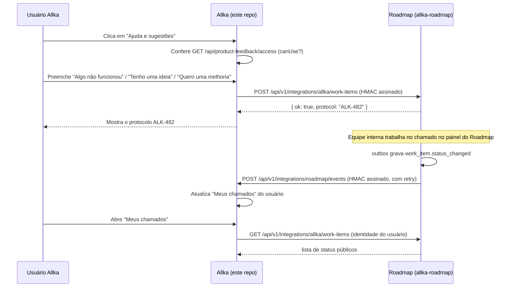

# Contrato de integração Allka ↔ Roadmap — v1.1.0

Status: **implementado e testado localmente (Lote 1).** As três rotas de criação/consulta
existem de verdade nos dois lados, assinadas por HMAC, e uma prova local ponta a ponta
(autenticar um usuário Allka descartável, abrir chamado, ver o protocolo, mudar status e
comentário no lado Roadmap, refletir em "Meus chamados", bloquear/desbloquear acesso pelo Admin)
passou com os dois backends rodando localmente. Nenhuma rota de produção/QA foi tocada — este
lote não fez deploy.

Este documento é o espelho versionado, com os mesmos schemas, de
`allka-roadmap/docs/integration-contract-v1.md`. Ao alterar um lado, altere o outro e suba
`CONTRACT_VERSION` junto. Uma cópia anterior deste texto também existe em
`entregas/CONTRATO-INTEGRACAO-ROADMAP-V1.md`; aquele arquivo não é mais atualizado — `docs/` é
a fonte versionada.

## 1. Visão geral

## 2. Identidade e autenticação

- O usuário comum **nunca autentica no Roadmap**. Ele só tem sessão na Allka.
- A Allka é a origem confiável: ela chama o Roadmap servidor-a-servidor, informando a
  `externalUserId` (identidade estável do usuário Allka) — nunca um cookie, JWT ou senha.
- Toda chamada servidor-a-servidor é assinada com **HMAC-SHA256** sobre o corpo bruto da
  requisição, com um timestamp no cabeçalho e uma janela de tolerância curta (proteção contra
  replay). Os nomes de secret já estão reservados desde `allka-roadmap/docs/DEPLOY-QA.md`:
  `QA_ALLKA_HMAC_KEY_ID`, `QA_ALLKA_HMAC_SECRET` (e os equivalentes de produção, quando existirem).
- Para a equipe interna (Owner/Admin/Developer/QA), o plano futuro é **SSO de curta duração /
  JIT** usando a mesma identidade externa da Allka — mantendo uma conta Owner local só para
  emergência (perda de acesso ao SSO). Sem SSO configurado, o login local por e-mail/senha do
  Roadmap continua sendo o único caminho, como é hoje.
- Nunca há compartilhamento de cookie, sessão ou JWT bruto entre as duas aplicações.

## 3. Versionamento

- Prefixo de rota: `/api/v1/integrations/...`.
- `CONTRACT_VERSION` (hoje `1.0.0`) é exportado pelos dois módulos de schema. Mudança
  incompatível de schema = nova major (`/api/v2/...`); campo novo opcional = minor; correção de
  texto/descrição = patch.
- Um endpoint `v1` nunca deve ser removido silenciosamente — precisa de depreciação anunciada e
  de um período em que `v1` e `v2` respondem em paralelo.

## 4. Criação contextual (Allka → Roadmap)

`POST /api/v1/integrations/allka/work-items` (implementado — ver
`allka-roadmap/apps/backend/src/routes/integrations/allka-work-items.ts`)

Schema: `WorkItemContextualCreateRequestSchema`.

Campos:

| Campo | Obrigatório | Descrição |
|---|---|---|
| `idempotencyKey` | sim | UUID gerado pelo cliente; reenvio com a mesma chave nunca duplica o chamado |
| `correlationId` | sim | UUID para rastrear a requisição nos logs dos dois lados |
| `type` | sim | `PROBLEM` \| `IDEA` \| `IMPROVEMENT` — vocabulário público, menor que o interno (`WorkItemType` tem 10 valores) |
| `title`, `description` | sim | Texto livre do usuário |
| `identity.externalUserId` | sim | Identidade estável do usuário Allka |
| `identity.externalWorkspaceContext` | não | `companyId`/`agencyId`/`portal`, quando fizer sentido |
| `page.pathname` | sim | Rota **sanitizada** — sem querystring sensível, sem fragmento |
| `page.pageTitle`, `page.frontendVersion` | não | Título da tela e versão/commit do frontend Allka |
| `page.environment` | sim | `production` \| `qa` \| `local` — nomes alinhados ao ambiente real deste projeto (o ambiente de teste chama-se QA aqui, não "homolog") |
| `steps`, `expectedResult`, `actualResult`, `impact` | não | Mesmo vocabulário já usado no formulário interno do Roadmap |
| `attachment` | não | Referência a um arquivo **já enviado** separadamente (nunca base64 inline aqui) |

Resposta: `WorkItemContextualCreateResponseSchema` → `{ ok: true, protocol: "ALK-123" }`.

### Nunca enviar neste payload (nem em nenhum outro desta integração)

- cookie, JWT ou senha;
- `localStorage`/`sessionStorage` completos;
- valor de campos de formulário que não sejam os campos do próprio chamado;
- fragmento da URL (`#...`);
- query params sensíveis (token, e-mail em texto claro na URL, etc.);
- screenshot automática sem uma ação explícita do usuário.

## 5. Consulta e status (Allka → Roadmap, em nome do usuário logado)

`GET /api/v1/integrations/allka/work-items` (lista, paginada por `cursor` ou filtrada por
`updatedSince`) e `GET /api/v1/integrations/allka/work-items/:protocol` (item único).

Schemas: `WorkItemListQuerySchema`, `WorkItemPublicStatusSchema`.

- O usuário comum só pode consultar itens cuja `identity.externalUserId` seja a dele — a Allka
  nunca repassa um `externalUserId` diferente do usuário autenticado na sessão que fez a chamada.
- `status` usa um vocabulário público menor (`RECEIVED`, `IN_PROGRESS`, `IN_VALIDATION`,
  `RESOLVED`, `REOPENED`, `CANCELLED`) — os 15 status internos do Kanban (`TRIAGE`,
  `IN_REVIEW`, `AWAITING_DEPLOY` etc.) nunca vazam para essa view pública.
- `publicComments` são comentários marcados como públicos pela equipe — as anotações internas
  do chamado nunca aparecem aqui.

## 6. Eventos duráveis (outbox nos dois lados)

Schema: `IntegrationEventEnvelopeSchema`, tipos em `IntegrationEventTypeSchema`:
`work_item.created`, `work_item.updated`, `work_item.status_changed`, `work_item.resolved`,
`work_item.reopened`, `release.published`.

- Cada lado grava o evento em uma tabela outbox local **antes** de tentar entregá-lo — a entrega
  é assíncrona e nunca bloqueia a operação que gerou o evento.
- Entrega assinada por HMAC, com `eventId` (UUID) usado para idempotência do lado que recebe —
  reprocessar o mesmo `eventId` nunca duplica efeito.
- Retry com backoff exponencial; falhas de entrega ficam registradas em log **sem guardar
  secrets nem o corpo assinado**.
- Nenhum dos dois lados grava diretamente no banco do outro — toda mudança de estado passa pela
  API assinada.

## 7. GitHub e deploy (informativo, nunca fecha sozinho)

Schema: `GithubLinkEventSchema` — reconhece o protocolo `ALK-123` em título/corpo de PR ou
mensagem de commit.

- PR aberto → atualiza o vínculo e o estágio técnico do chamado (ex.: "em revisão").
- PR mergeado → avança o estágio técnico, mas **não fecha o chamado sozinho**.
- Deploy bem-sucedido → pode mover para "aguardando validação".
- **`DONE` sempre exige `solutionSummary` preenchido e evidência de validação da QA registrada**
  — nunca é automático só por causa de um merge ou deploy.
- Reabertura sempre volta o item para a fila e preserva todo o histórico anterior — nada é
  apagado.

## 8. Códigos de erro

`IntegrationErrorResponseSchema` — `{ ok: false, code, message }`:

| Código | Quando acontece |
|---|---|
| `INVALID_PAYLOAD` | corpo não bate com o schema Zod |
| `INVALID_SIGNATURE` | HMAC ausente, incorreto ou fora da janela de tempo aceita |
| `IDEMPOTENCY_CONFLICT` | mesma `idempotencyKey` com corpo diferente do original |
| `UNKNOWN_EXTERNAL_USER` | `externalUserId` não reconhecido pelo Roadmap |
| `RATE_LIMITED` | limite de requisições por identidade/origem excedido |
| `INTEGRATION_DISABLED` | feature flag técnica desligada (ver `entregas/ADENDO-COPILOT-CONTROLE-DE-ACESSO-AO-BOTAO-DE-CHAMADOS.md`) |

## 9. Compatibilidade e testes de contrato

- `apps/backend/src/contracts/allka-integration.ts` (allka-roadmap) é a fonte da verdade dos
  schemas Zod; `apps/backend/src/lib/roadmap-integration-contract.ts` (este repo) espelha as
  mesmas formas — comparados campo a campo antes de cada mudança.
- allka-roadmap valida com vitest em `allka-integration.contract.test.ts`
  (`npm run test:unit --workspace apps/backend`).
- Este repo agora também tem um teste de contrato real:
  `apps/backend/src/lib/roadmap-integration-contract.test.ts`, usando `node:test` +
  `node:assert/strict` via `tsx --test` — sem instalar um framework de teste novo, já que
  `apps/backend` aqui não tinha nenhum configurado. Rodar com:
  `npm run test:roadmap-contract --workspace apps/backend`.
- Os dois arquivos de teste usam os mesmos exemplos válidos/inválidos (mesmo protocolo `ALK-123`,
  mesma rejeição de campo extra por `.strict()`, mesma rejeição de `homolog` em favor de `qa`)
  para que uma mudança de contrato precise passar nos dois lados.

## 10. O que este contrato NÃO cobre ainda

- Outbox e eventos duráveis — "Meus chamados" hoje atualiza por consulta manual e polling de
  ~30s enquanto a tela está aberta, não por webhook.
- Vínculo com GitHub/deploy.
- SSO/JIT real para a equipe interna.
- Anexo/screenshot no formulário da Allka.
- Qualquer coisa em produção ou QA — este lote rodou só localmente, sem deploy.

O que já existe e funciona (Lote 1): as três rotas de integração no Roadmap, assinatura HMAC
v1.1.0, idempotência, e do lado Allka o controle de acesso (grupos/overrides/auditoria), o
cliente HTTP assinado, os endpoints `/api/product-feedback/*` e `/api/admin/product-feedback/*`,
o botão "Ajuda e sugestões", "Meus chamados" e a página `/admin/acesso-chamados`.
